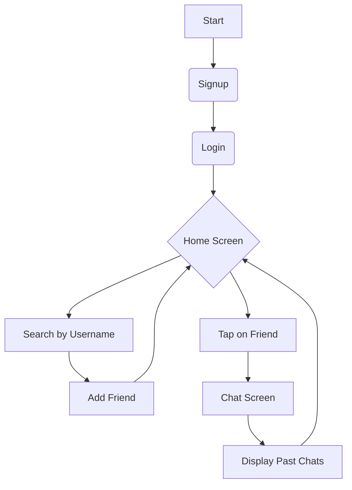
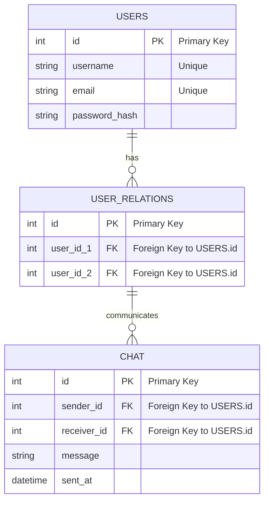

# Real-Time-Chat

このプロジェクトは、2月の春休み期間を利用して、Go言語、Redis、およびgRPCを用いてリアルタイムでの通信が可能なチャットアプリケーションを開発することを目的としています。

## 技術スタック

- **言語**: Go
- **データストア**: PostgresSQL, Redis
- **ORM**: ent
- **通信**: gRPC

## 主な機能

- ユーザー間でのリアルタイムメッセージング

## システム設計
### フローチャート

### データベース設計
